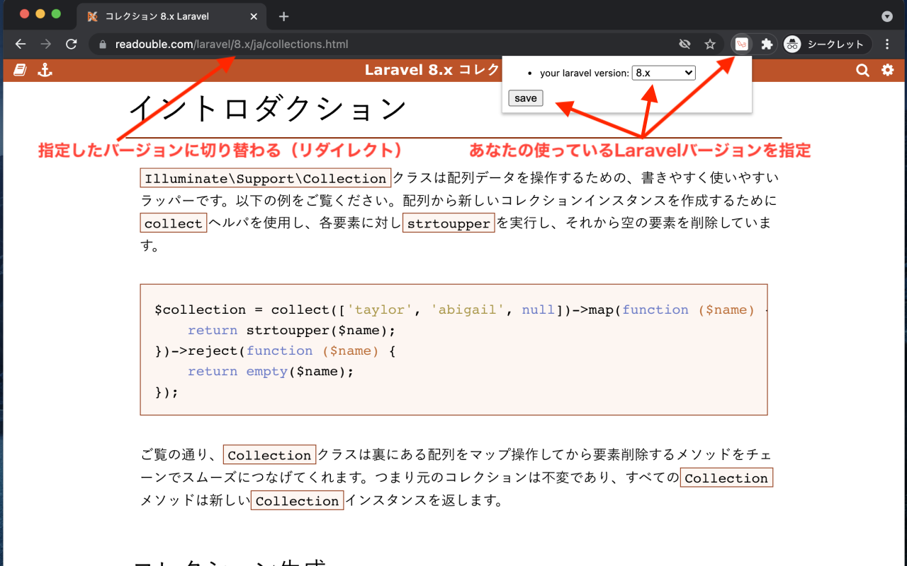

# ReadDoubleRedirect
* [Chrome ウェブストア RedirectReadouble](https://chrome.google.com/webstore/detail/redirectreadouble/dhjhhbpfjibmbanhflnpcmmlnjjdpopn?hl=ja&authuser=0)

## 概要

* Google Chrome の拡張機能です。
* あらかじめ、設定画面で自身の使っている、Laravelバージョンを設定しておくと、
* [Laravel 日本語ドキュメント](https://readouble.com/)の URLを設定したバージョンに書き換えてリダイレクトします。
* 例）設定が Laravel8 の場合
  - https://readouble.com/laravel/5.8/ja/collections.html

  - → https://readouble.com/laravel/8.x/ja/collections.html
* これでスムーズにLaravel日本語ドキュメントを閲覧することが可能です。

## 免責事項
* [Laravel 日本語ドキュメント](https://readouble.com/) の運営元とは一切関係ない、オレオレツールです。
* この、Google Chrome 拡張機能に関する問い合わせは、[Laravel 日本語ドキュメント](https://readouble.com/) に行わないでください。
* [Laravel 日本語ドキュメント](https://readouble.com/) には大変お世話になっております。この場を借りて感謝をお伝えします。

## 実装の参考にしたサイト

- [Chrome拡張の作り方 (超概要)](https://qiita.com/RyBB/items/32b2a7b879f21b3edefc)
- [Chromeの拡張機能を自作する](https://toranoana-lab.hatenablog.com/entry/2020/04/23/174421)
- [公式のサンプルスクリプト](https://github.com/GoogleChrome/chrome-extensions-samples)
